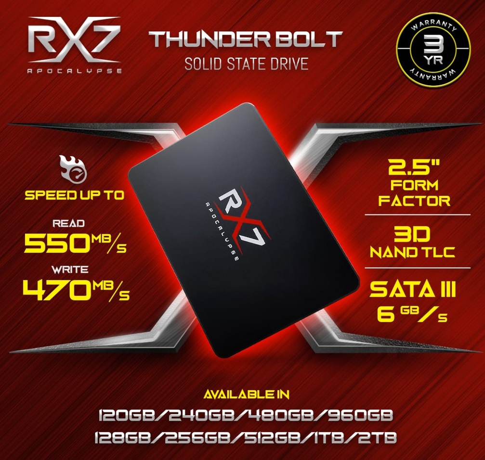

# Tugas-Sistem-Operasii
- Laptop  
- Sistem Operasi
- Procesesor
- Software
- Hardware
- Penyimpanan

## A. Eskplorasi Komputer

##   **1. Laptop**

*Saya menggunakan Laptop **Lenovo Idepad 320**, laptop ini kurang lebih 4 tahunan sudah saya gunakan. mungkin dari segi tampilan dan hardware yang ada dilaptop ini sudah sangat jadul dijaman sekarang, tapi untuk keperluan saya yang tidak terlalu berat alhamdullilah masih bisa bertahan. Rencanaya tahun depan mau upgrade si hehehe*

## **2. Sistem Operasi**

*Untuk sistem operasi saya saya menggunakan **Windows 10** Mungkin bakal jadi pertanyaan kenapa ga Upgrage ke Windows 11, Jawabanya ya karna udah nyaman sama yang ini*

## **3. Prosesor**

*Untuk Prosesor saya menggunakan **AMD A9 GEN 7** mungkin dijaman sekarang ini prosesor sudah sangat jauh ketinggalan tapi selama saya pakai alhamdullilah masih lancar-lancar saja*

## **4. Software**
- Discord 

Discord menjadi salah satu aplikasi yang sering saya gunakan dilaptop ini, karna dari discord saya bisa banyak dapat teman entah itu temen dalam game atau cuman sebatas tukar informasi. 

- Office 365

Software ini mungkin menjadi salah satu yang terpenting bagi semua orang karna emang dibutuhin. Contohnya saja seperti word,excel, power point dan lainya.

- Visual Studio Code

Software ini juga sama seperti Office 365 menjadi hal penting terutama bagi anak IT, bukan hanya VSC editor yang saya gunakan dilaptop ini ada juga beberapa editor seperti Idle python, MariaDB, NotePad.

Dari 3 Point diatas adalah aplikasi yang sering saya gunakan dilaptop ini, Untuk Chrome itu mungkin udah menjadi salah satu Software yang sering dibuka semua orang ya. Ada juga beberapa Software yang pernah saya gunakan dan masih saya gunakan. Contohnya seperti Idle python, NotePad, Photoshop, CorelDraw, Figma, Bluestack, MariaDb, Steam, Canva, Obs.

## **5. Hardware** 
| Processor             	| AMD Dual   Core A9 9420 3.0GHz up to 3.6GHz                                     	|
|-----------------------	|---------------------------------------------------------------------------------	|
| RAM                   	| 4 GB                                                                            	|
| Resolusi Display      	| 1366 x   768 – HD                                                               	|
| VGA                   	| AMD   Radeon R5 Graphics+R7 Dedicated 2GB                                       	|
| Ukuran Layar          	| 14 inch                                                                         	|
| Sistem Operasi        	| Windows                                                                           |
| Tipe memory           	| DDR4                                                                            	|
| Kapasitas Penyimpanan 	| 1 TB                                                                            	|
| Konektivita
s          	| 802.11   ac, 10/100/1000M Gigabit Ethernet, Bluetooth® 4.0 Combo with WiFi Card 	|
| Berat Produk          	| 2.2 kg                                                                          	|
| Dimensi Ukuran        	| 379 x 260   x 22.9 mm                                                           	|
| Baterai               	| 30 WHr                                                                          	|
| Audio                 	| 2 x   Stereo Speakers with Dolby Audio™                                         	|

- *Untuk spesifikasi diatas ada beberapa perubahan sekarang. seperti media penyimpanan sudah saya ganti dengan SSD agar mendukung peforma dalam menjalankan operating system dan aplikasi.*

## **6. Penyimpanan**

*Untuk media penyimpanan saya sudah menggunakan SSD,awalnya laptop ini belum menggunakan SSD tapi masih HDD karna merasa lemot saat menjalan aplikasi dan booting alhasil saya upgrade ke SSD. Disitulah semuanya berubah serasa semuanya sangat cepat, saya masih menggunakan HDD untuk media penyimpanan seperti file tugas,film,foto dan lain lain, untuk SSD sendiri saya pakai untuk menjalankan operating system dan aplikasi.*

## B. Perkembangan Komputer
*Komputer adalah alat yang dipakai untuk mengolah data menurut perintah yang telah diprogram. Kata komputer semula dipergunakan untuk menggambarkan orang yang perkerjaannya melakukan perhitungan aritmetika, dengan atau tanpa alat bantu, tetapi arti kata ini kemudian dipindahkan kepada mesin itu sendiri.*
## Awal Penemuan Komputer

Sejak dahulu kala, proses pengolahan data telah dilakukan oleh manusia. Manusia juga menemukan alat-alat mekanik dan elektronik untuk membantu manusia dalam penghitungan dan pengolahan data supaya bisa mendapatkan hasil lebih cepat. Komputer yang kita temui saat ini adalah suatu evolusi panjang dari penemuan-penemuan manusia sejah dahulu kala berupa alat mekanik maupun elektronik.  Saat ini komputer dan piranti pendukungnya telah masuk dalam setiap aspek kehidupan dan
pekerjaan. Komputer yang ada sekarang memiliki kemampuan yang lebih dari sekedar perhitungan
matematik biasa. 

Bagaimanapun juga alat pengolah data dari sejak jaman purba sampai saat ini bisa kita golongkan ke dalam 4 golongan besar.
1. Peralatan manual : yaitu peralatan pengolahan data yang sangat sederhana, dan faktor terpenting
dalam pemakaian alat adalah menggunakan tenaga tangan manusia
2. Peralatan Mekanik : yaitu peralatan yang sudah berbentuk mekanik yang digerakkan dengan
tangan secara manual
3. Peralatan Mekanik Elektronik : Peralatan mekanik yang digerakkan oleh secara otomatis oleh
motor elektronik
4. Peralatan Elektronik : Peralatan yang bekerjanya secara elektronik penuh

#### **Alat Hitung Tradisional dan Kalkulator Mekanik**
Abacus, yang muncul sekitar 5000 tahun yang lalu di Asia kecil dan masih digunakan di beberapa tempat hingga saat ini, dapat dianggap sebagai awal mula mesin komputasi. Alat ini memungkinkan penggunanya untuk melakukan perhitungan menggunakan biji-bijian geser 
yang diatur pada sebuh rak. Para pedagang di masa itu menggunakan abacus untuk menghitung 
transaksi perdagangan. Seiring dengan munculnya pensil dan kertas, terutama di Eropa, abacus 
kehilangan popularitasnya. 

Setelah hampir 12 abad, muncul penemuan lain dalam hal mesin komputasi. Pada tahun 1642, 
Blaise Pascal (1623-1662), yang pada waktu itu berumur 18 tahun, menemukan apa yang ia sebut 
sebagai kalkulator roda numerik (numerical wheel calculator) untuk membantu ayahnya melakukan perhitungan pajak. 

Kotak persegi kuningan ini yang dinamakan Pascaline, menggunakan delapan roda putar bergerigi untuk menjumlahkan bilangan hingga delapan digit. Alat ini merupakan alat penghitung bilangan berbasis sepuluh. Kelemahan alat ini adalah hanya terbatas untuk melakukan penjumlahan.

Tahun 1694, seorang matematikawan dan filsuf Jerman, Gottfred Wilhem von Leibniz (1646-1716) 
memperbaiki Pascaline dengan membuat mesin yang dapat mengalikan. Sama seperti pendahulunya, 
alat mekanik ini bekerja dengan menggunakan roda-roda gerigi. 

Dengan mempelajari catatan dan gambar-gambar yang dibuat oleh Pascal, Leibniz dapat 
menyempurnakan alatnya. Barulah pada tahun 1820, kalkulator mekanik mulai populer. Charles 
Xavier Thomas de Colmar menemukan mesin yang dapat melakukan empat fungsi aritmatik dasar. 
Kalkulator mekanik Colmar, arithometer, mempresentasikan pendekatan yang lebih praktis dalam 
kalkulasi karena alat tersebut dapat melakukan penjumlahan, pengurangan, perkalian, dan 
pembagian. Dengan kemampuannya, arithometer banyak dipergunakan hingga masa Perang Dunia I. 
Bersama-sama dengan Pascal dan Leibniz, Colmar membantu membangun era komputasi mekanikal. 

- Generasi pertama dimulai ketika komputer digunakan dalam akademi dan militer, seperti Komputer Atanasoff-Berry dibuat pada tahun 1937 untuk menyelesaikan sistem persamaan linear dan komputer Colossus untuk memecahkan kode rahasia Jerman Nazi. Kemudian, ENIAC yang dibangun pada tahun 1946 menjadi komputer pertama untuk tujuan umum. Ketika komputernya dinyalakan untuk pertama kali, Philadelphia mengalami mati listrik. Komputer generasi ini menggunakan tabung vakum untuk menyimpan data dan ukurannya memakan satu ruangan.

- Generasi kedua dimulai ketika transistor menggatikan tabung vakum. UNIVAC diperkenalkan ke publik tahun 1951 untuk penggunaan komersial. Kemudian, pada tahun 1953, IBM memulai bisnis komputernya dengan merilis IBM 650 dan IBM 700. Berbagai bahasa pemrograman mulai dikembangkan dan komputer mulai memiliki memori dan sistem operasi.

- Generasi ketiga dimulai ketika teknologi transistor meningkat menjadi sirkuit terpadu. Komputer mini adalah inovasi yang signifikan dalam generasi ini dan mempengaruhi generasi komputer selanjutnya. NASA menggunakan komputer generasi ini untuk melancarkan Program Apollo, seperti Komputer Bimbingan Apollo untuk mempermudah kendali Apollo Command/Service Module. Digital Equipment Corporation menjadi perusahaan komputer nomor dua di belakang IBM dengan komputer PDP dan VAX-nya. Komputer ini membawa ke pengembangan sistem operasi yang berpengaruh, Unix.

- Generasi keempat dimulai pada dasawarsa 1970-an ketika penemuan MOSFET dan integrasi berskala besar selanjutnya membawa ke pengembangan mikroprosesor di awal 1970-an. komputer pribadi yang semakin kecil berkat mikroprosesor mulai berkembang, dimulai dari komputer rumahan dan komputer meja. Teknologi selanjutnya adalah laptop dan ponsel cerdas yang sangat fenomenal, membawa berbagai perusahaan teknologi ke dalam perang paten atas ponsel cerdas.

- Generasi kelima digadang-gadang sebagai tahapan perkembangan teknologi paling canggih saat ini dan diciptakan pertama kali pada tahun 1980-an. Peningkatan dari segi visualisasi, menjadikan tampilan visual pada komputer di generasi kelima mempunyai resolusi sangat tinggi dan begitu tajam. Negara yang mempelopori sejarah perkembangan komputer pada generasi kelima adalah Jepang. Dalam proses pengembangannya, terdapat penambahan komponen-komponen penting ke dalam sistem komputer modern saat ini. Hal ini dikarenakan komponen yang digunakan pada komputer generasi kelima adalah menerapkan ragam teknologi modern, seperti superkonduktor, ULSI, dan kecerdasan buatan (atau kalian lebih mengenalnya dengan sebutan Artificial Intelligence).

## Ciri-Ciri Komputer Generasi Pertama Hingga kelima

### 1. Komputer Generasi Pertama (1940-1959)
*Dengan terjadinya Perang Dunia II, negara-negara yang terlibat dalam perang tersebut berusaha mengembangkan komputer untuk mengeksploitasi potensi strategis yang dimiliki komputer. Hal ini meningkatkan pendanaan pengembangan komputer serta mempercepat kemajuan teknik komputer. Pada tahun 1941, Conrad Zuse, seorang insinyur Jerman, membangun sebuah komputer, Z3, untuk mendesain pesawat terbang dan peluru kendali.*
*Blok sekutu juga membuat kemajuan lain dalam pengembangan kekuatan komputer. Tahun 1943, Inggris menyelesaikan komputer pemecah kode rahasia yang dinamakan Komputer Colossus untuk memecahkan kode rahasia yang digunakan Jerman Nazi. Dampak pembuatan Colossus tidak terlalu memengaruhi perkembangan industri komputer dikarenakan dua alasan. Pertama, Colossus bukan merupakan komputer serbaguna, tetpai ia hanya didesain untuk memecahkan kode rahasia. Kedua, keberadaan mesin ini dijaga kerahasiaannya hingga satu dekade setelah perang berakhir.*
*Usaha yang dilakukan oleh Amerika Serikat pada saat itu menghasilkan suatu kemajuan lain. Howard Aiken, seorang insinyur Harvard yang bekerja dengan IBM, berhasil memproduksi kalkulator elektronik untuk Angkatan Laut Amerika Serikat. Kalkulator tersebut berukuran panjang setengah lapangan bola kaki dan memiliki rentang kabel sepanjang 500 mil. The Harvard-IBM Automatic Sequence Controlled Calculator, atau Mark I, merupakan komputer relai elektronik.*
*Ia menggunakan sinyal elektromagnetik untuk menggerakkan komponen mekanik. Mesin tersebut beroperasi dengan lambat (ia membutuhkan 3-5 detik untuk setiap perhitungan) dan tidak fleksibel (urutan kalkulasi tidak dapat diubah). Kalkulator tersebut dapat melakukan perhitungan aritmatik dasar dan persamaan yang lebih kompleks.*
*Sejarah perkembangan komputer lain pada masa itu adalah Electronic Numerical Integrator and Computer (ENIAC), yang dibuat atas kerja sama antara pemerintah Amerika Serikat danUniversitas Pennsylvania. Terdiri dari 18.000 tabung vakum, 70.000 resistor, dan 5 juta titik solder, komputer tersebut merupakan mesin yang sangat besar dan mengonsumsi daya sebesar 160 kW. Dirancang oleh John Presper Eckert dan John Mauchly, ENIAC merupakan komputer serbaguna yang bekerja 1000 kali lebih cepat dibandingkan Mark I.*

**Ciri-ciri:**

- Program dibuat dalam bahasa mesin.
- Menggunakan konsep storage program.
- Komponen yang digunakan adalah tabung hampa udara.
- Ukuran fisiknya besar, sehingga membutuhkan daya listrik yang besar.
- Dapat disimpan di magnetic tape dan magnetic disk.
- Contohnya komputer IBM 701 buatan tahun 1953 sebagai komputer komersial berukuran besar dan IBM 705 yang dibuat tahun 1959 untuk industri

### 2. Komputer Generasi Kedua (1959-1965)
*Pada tahun 1948, penemuan transistor sangat memengaruhi perkembangan komputer. Transistor menggantikan tabung vakum di televisi, radio, dan komputer. Akibatnya, ukuran mesin-mesin elektrik berkurang drastis. Transistor mulai digunakan di dalam komputer mulai pada tahun 1956.*
*Penemuan lain yang berupa pengembangan memori inti-magnetik membantu pengembangan komputer generasi kedua yang lebih kecil, lebih cepat, lebih dapat diandalkan, dan lebih hemat energi dibanding para pendahulunya. Mesin pertama yang memanfaatkan teknologi baru ini adalah superkomputer. IBM membuat superkomputer bernama Stretch, dan Sprery-Rand membuat komputer bernama LARC.*
*Komputer-komputer ini, yang dikembangkan untuk laboratorium energi atom, dapat menangani sejumlah besar data, sebuah kemampuan yang sangat dibutuhkan oleh peneliti atom. Mesin tersebut sangat mahal dan cenderung terlalu kompleks untuk kebutuhan komputasi bisnis, sehingga membatasi kepopulerannya.*
*Hanya ada dua LARC yang pernah dipasang dan digunakan. Satu terdapat di Lawrence Radiation Labs di Livermore, California, dan yang lainnya di US Navy Research and Development Center di Washington D.C. Komputer generasi kedua menggantikan bahasa mesin dengan Bahasa rakitan. Bahasa rakitan adalah bahasa yang menggunakan singkatan-singakatan untuk menggantikan kode biner.*

**Ciri-ciri:**

- Kapasitas memori utama cukup besar.
- Komponen yang digunakan adalah transistor yang jauh lebih kecil dibandingkan tabung hampa udara.
- Menggunakan magnetic tape dan magnetic disk yang berbentuk removable disk.
- Mempunyai kemampuan proses real-time dan time sharing.
- Proses operasinya lebih cepat.
- Orientasinya pada aplikasi bisnis dan teknik.
- Contohnya komputer PDP-5 dan PDP-8 buatan tahun 1963 sebagai komputer mini komersial pertama. Selain itu ada pula komputer IBM 7070, IBM 1400, NCR 300, dan sebagainya.

### 3. Komputer Generasi Ketiga (1965-1970)
*Walaupun transistor dalam banyak hal mengungguli tube vakum, namun transistor menghasilkan panas yang cukup besar, yang dapat berpotensi merusak bagian-bagian internal komputer. Batu kuarsa menghilangkan masalah ini. Jack Kilby, seorang insinyur di Texas Instruments, mengembangkan sirkuit terpadupada tahun 1958. IC mengkombinasikan tiga komponen elektronik dalam sebuah piringan silikon kecil yang terbuat dari pasir kuarsa.*
*Para ilmuwan kemudian berhasil memasukkan lebih banyak komponen-komponen ke dalam suatu chip tunggal yang disebut semikonduktor. Hasilnya, komputer menjadi semakin kecil karena komponen-komponen dapat dipadatkan dalam chip. Kemajuan komputer generasi ketiga lainnya adalah penggunaan sistem operasi (operating system) yang memungkinkan mesin untuk menjalankan berbagai program yang berbeda secara serentak dengan sebuah program utama yang memonitor dan mengkoordinasi memori komputer.*

**Ciri-ciri:**

- Komponen yang dipakai adalah IV (Integrated Circuits) yang terdiri atas ratusan atau ribuan transistor berbentuk hybrid integrated circuits dan monolithic integrated circuits.
- Proses operasinya jauh lebih cepat dan lebih tepat, kapasitas memori komputer jauh lebih besar.
- Ukuran fisik jauh lebih kecil sehingga penggunaan listrik lebih hemat.
- Menggunakan magnetic disk yang sifatnya random access.
- Dapat melakukan multiprocessing dan multiprogramming.
- Alat input-output mengalami pengembangan dengan menggunakan visual display terminal.
- Dapat melakukan komunikasi data dari satu komputer dengan komputer lainnya.
- Contohnya komputer IBM S/30. NOVA, CDC 3000, PDP-11, dan sebagainya.

### 4. Komputer Generasi Keempat (dimulai dari tahun 1970)

*Setelah IC, tujuan pengembangan menjadi lebih jelas: mengecilkan ukuran sirkuit dan komponen-komponen elektrik. Large Scale Integration (LSI) dapat memuat ratusan komponen dalam sebuah chip. Pada tahun 1980-an, Very Large Scale Integration (VLSI) memuat ribuan komponen dalam sebuah chip tunggal.*
*Ultra-Large Scale Integration (ULSI) meningkatkan jumlah tersebut menjadi jutaan. Kemampuan untuk memasang sedemikian banyak komponen dalam suatu keping yang berukurang setengah keping uang logam mendorong turunnya harga dan ukuran komputer.*
*Hal tersebut juga meningkatkan daya kerja, efisiensi dan keterandalan komputer. Chip Intel 4004 yang dibuat pada tahun 1971 membawa kemajuan pada IC dengan meletakkan seluruh komponen dari sebuah komputer (central processing unit, memori, dan kendali input/output) dalam sebuah chip yang sangat kecil. Sebelumnya, IC dibuat untuk mengerjakan suatu tugas tertentu yang spesifik.*
*Kini, sebuah mikroprosesor dapat diproduksi dan kemudian diprogram untuk memenuhi seluruh kebutuhan yang diinginkan. Tidak lama kemudian, setiap peranti rumah tangga seperti microwave, oven, televisi, dan mobil dengan electronic fuel injection (EFI) dilengkapi dengan mikroprosesor.*
*Perkembangan yang demikian memungkinkan orang-orang biasa untuk menggunakan komputer biasa. Komputer tidak lagi menjadi dominasi perusahaan-perusahaan besar atau lembaga pemerintah. Pada pertengahan tahun 1970-an, perakit komputer menawarkan produk komputer mereka ke masyarakat umum. Komputer-komputer ini, yang disebut minikomputer, dijual dengan paket peranti lunak yang mudah digunakan oleh kalangan awam.*
*Peranti lunak yang paling populer pada saat itu adalah program word processing dan spreadsheet. Pada awal 1980-an, video game seperti Atari 2600 menarik perhatian konsumen pada komputer rumahan yang lebih canggih dan dapat diprogram.*

**Ciri-ciri:**
- Penggunaan LSI (Large Scale Integration) yang disebut juga sebagai Bipolar Large Scale Integration.
- Menggunakan mikroprosesor dan semikonduktor yang berbentuk chip untuk memori komputer.
- Contohnya, komputer IBM 370 menggunakan Intel 4004 mikroprosesor yang dikembangkan pertama kali pada tahun 1971 oleh perusahaan Intel Corporation dengan menggunakan chip mikroprosesor.
- Personal computer atau PC mulai berkembang sejak tahun 1977. Contohnya komputer Apple II dan komputer dekstop oleh Xerox Corporation.
- Pada tahun 1981, komputer mulai banyak menggunakan sistem Window dan mouse.

### 5. Komputer Generasi Kelima

*Contoh imajinatif komputer generasi kelima adalah komputer fiksi HAL9000 dari novel karya Arthur C. Clarke berjudul 2001: Space Odyssey. HAL menampilkan seluruh fungsi yang diinginkan dari sebuah komputer generasi kelima. Dengan kecerdasan buatan (artificial intelligence atau AI), HAL dapat cukup memiliki nalar untuk melakukan percapakan dengan manusia, menggunakan masukan visual, dan belajar dari pengalamannya sendiri.*
*Walaupun mungkin realisasi HAL9000 masih jauh dari kenyataan, banyak fungsi-fungsi yang dimilikinya sudah terwujud. Beberapa komputer dapat menerima instruksi secara lisan dan mampu meniru nalar manusia. Kemampuan untuk menterjemahkan bahasa asing juga menjadi mungkin. Fasilitas ini tampak sederhana. Namun fasilitas tersebut menjadi jauh lebih rumit dari yang diduga ketika programmer menyadari bahwa pengertian manusia sangat bergantung pada konteks dan pengertian ketimbang sekadar menterjemahkan kata-kata secara langsung.*
*Banyak kemajuan di bidang desain komputer dan teknologi yang semakin memungkinkan pembuatan komputer generasi kelima. Dua kemajuan rekayasa yang terutama adalah kemampuan pemrosesan paralel, yang akan menggantikan model non Neumann. Model non Neumann akan digantikan dengan sistem yang mampu mengkoordinasikan banyak CPU untuk bekerja secara serempak. Kemajuan lain adalah teknologi superkonduktor yang memungkinkan aliran elektrik tanpa ada hambatan apapun, yang nantinya dapat mempercepat kecepatan informasi.*
*Jepang adalah negara yang terkenal dalam sosialisasi jargon dan proyek komputer generasi kelima. Lembaga ICOT (Institute for new Computer Technology) juga dibentuk untuk merealisasikannya. Banyak kabar yang menyatakan bahwa proyek ini telah gagal, namun beberapa informasi lain bahwa keberhasilan proyek komputer generasi kelima ini akan membawa perubahan baru paradigma komputerisasi di dunia.*

**Ciri-ciri:**
- Komponen yang dipakai adalah VLSI (Very Large Scale Integration).
- Kemampuan komputer dikembangakan untuk memecahkan masalah sendiri dengan bantuan AI (Artificial Intelligence). AI dapat diterapkan untuk mengoperasikan robot.
- Mulai dikembangkan komputer yang dapat menggantikan chip.
- Jepang adalah negara yang memelopori komputer generasi kelima.

